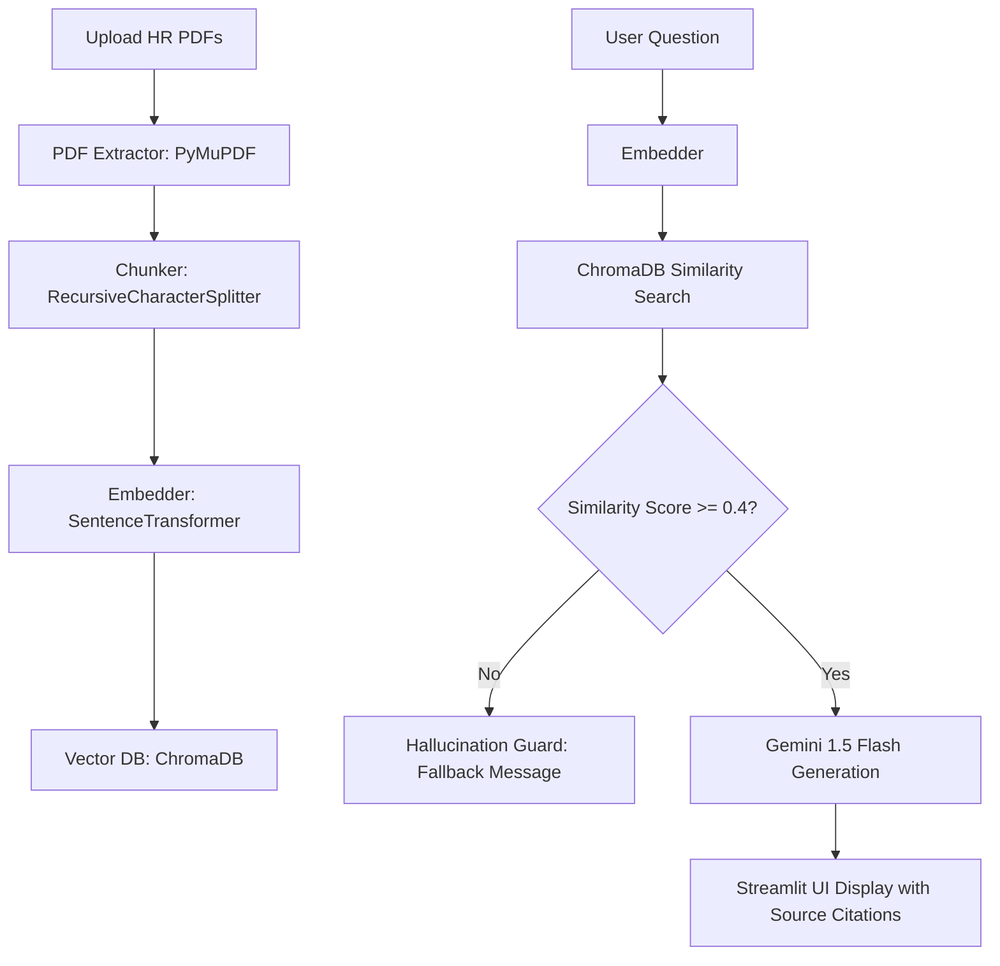

# 🏢 The Intelligent HR Policy & Payroll Assistant (RAG System)

This is a production-ready Retrieval-Augmented Generation (RAG) system built with **Streamlit**, **PyMuPDF**, **LangChain**, **SentenceTransformers**, **ChromaDB**, and **Google Gemini 1.5 Flash**.

It allows employees to ask questions about company HR policies, medical leaves, travel policies, and gratuity calculations, returning answers **only** when supported by uploaded corporate PDF manuals.

---

## 🎯 Architecture Diagram



---

## 🚀 Getting Started

### 📋 Prerequisites
- Python 3.9+ installed
- Google Gemini API key (from [Google AI Studio](https://aistudio.google.com/))

### 🛠️ Installation

1. Navigate to the project directory:
   ```bash
   cd hr-rag-assistant
   ```

2. Install dependencies:
   ```bash
   pip install -r requirements.txt
   ```

### ⚙️ Environment Configuration

1. Copy the `.env.example` file to `.env`:
   ```bash
   cp .env.example .env
   ```

2. Open the `.env` file and insert your Google Gemini API key:
   ```env
   GEMINI_API_KEY=AIzaSy...your_actual_key_here...
   ```

### 💻 Running the Application

Launch the Streamlit web interface using the following command:
```bash
streamlit run app.py
```

---

## 📂 Project Structure

- `app.py`: Standard Streamlit graphical interface with customized glassmorphic panels and chat bubbles.
- `rag_engine/`: Package containing core backend processing components.
  - `pdf_extractor.py`: Extracts clean text from target PDFs page-by-page using PyMuPDF.
  - `chunker.py`: Splits extracted pages into overlaps using LangChain's RecursiveTextSplitter.
  - `embedder.py`: Handles vector conversions locally using the `all-MiniLM-L6-v2` transformer model.
  - `vector_store.py`: Client connection and query operations for the local Chroma database.
  - `llm_client.py`: System prompt compilation and execution of generation requests against Gemini API.
- `data/sample_hr_docs/`: Repository folder where source PDFs are stored during execution.
- `chroma_db/`: Directory managed by ChromaDB containing index and vectors.
- `.env`: Location for local configuration and Gemini API Key secrets (ignored by Git).
